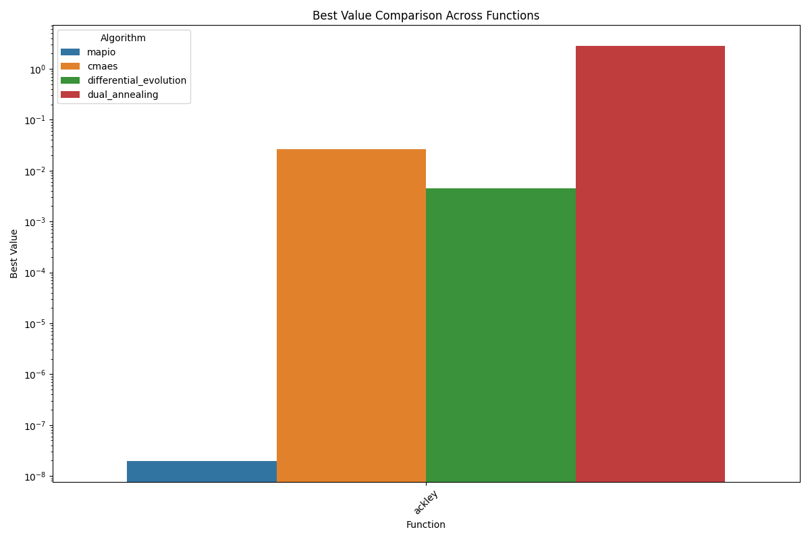
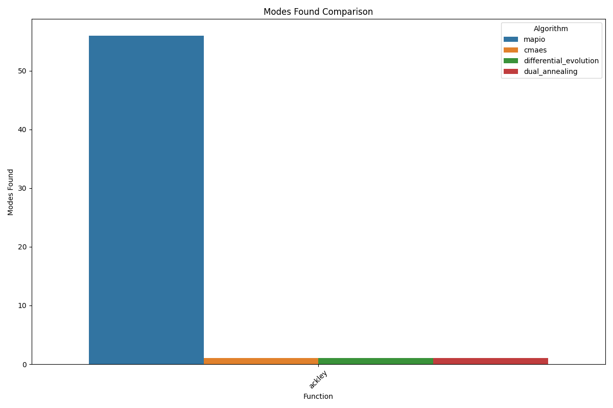
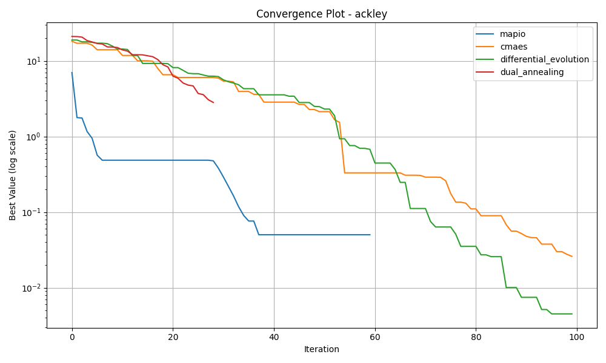
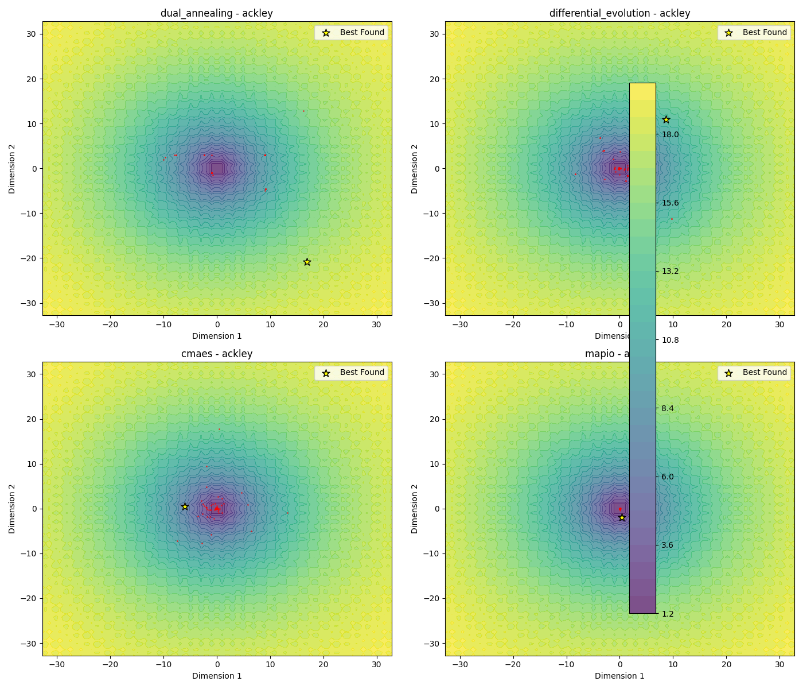
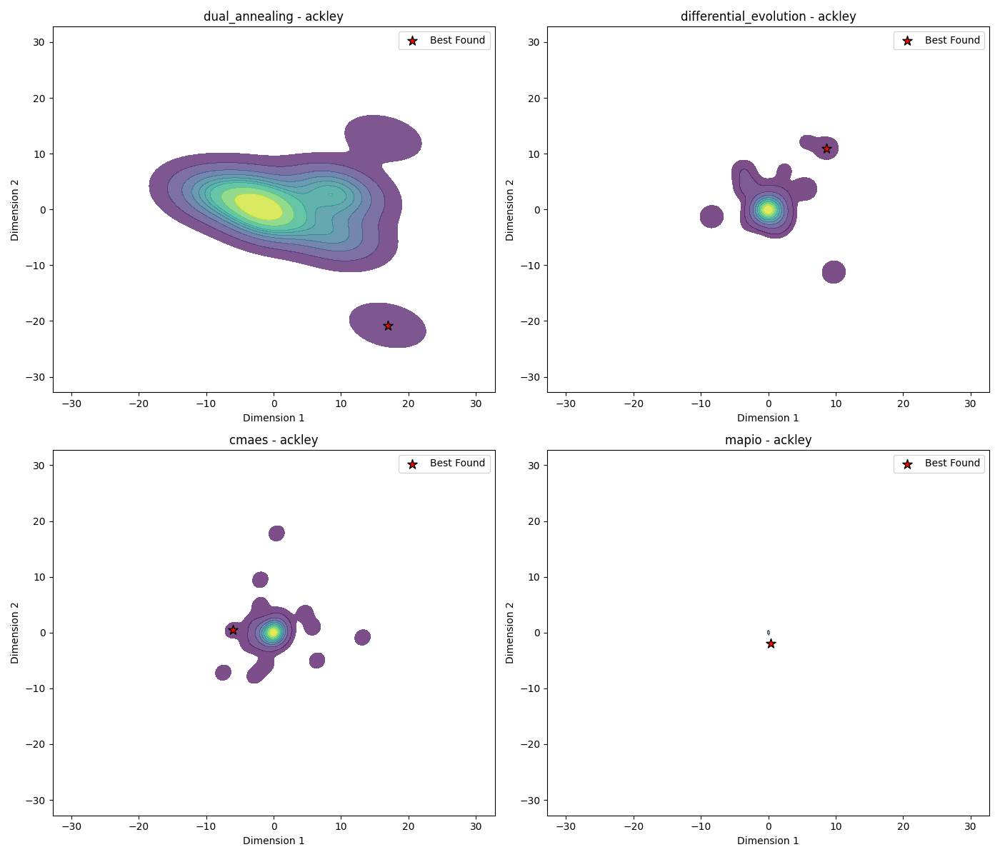
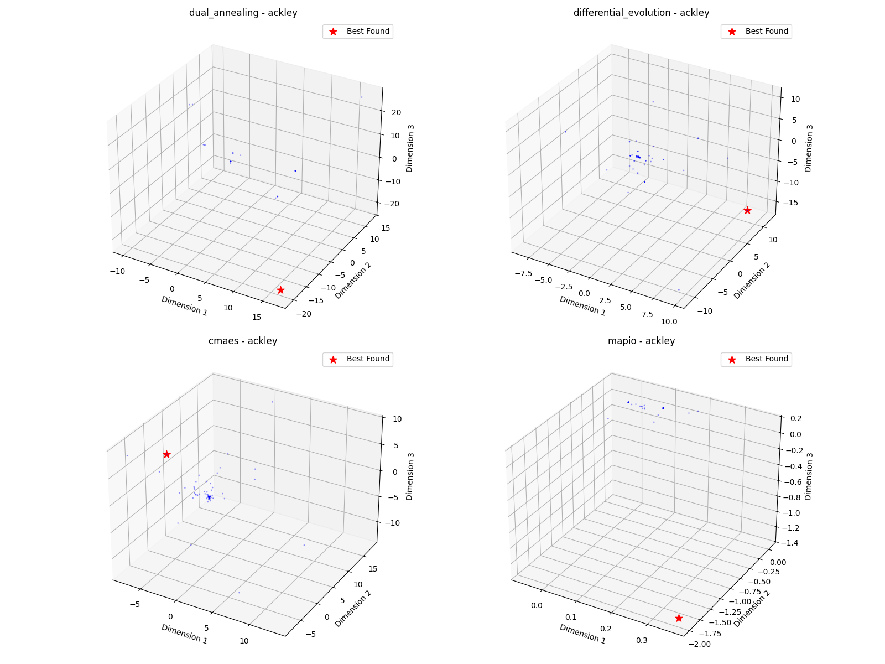

# Ackley-10d Optimization Algorithm Benchmark Report

*Generated on 2025-03-10 20:18:43*

## Benchmark Overview

**Test Functions:** ackley

**Algorithms:** cmaes, differential_evolution, dual_annealing, mapio

## Summary Results

| Function | Dimension | cmaes Best Value | differential_evolution Best Value | dual_annealing Best Value | mapio Best Value |
| --- | --- | --- | --- | --- | --- |
| ackley | 10 | 2.6002e-02 | 4.5129e-03 | 2.8143e+00 | 1.9536e-08 |

## Visualization Summary

## ackley Function

**Description:** Function with many local minima and a global minimum at the origin.

### Convergence Plot

### 2D Exploration

### Search Density

### 3D Exploration

### Algorithm Performance

| Algorithm | Best Value | Modes Found |
| --- | --- | --- |
| mapio | 1.953626e-08 | 56 |
| cmaes | 2.600241e-02 | 1 |
| differential_evolution | 4.512884e-03 | 1 |
| dual_annealing | 2.814350e+00 | 1 |

