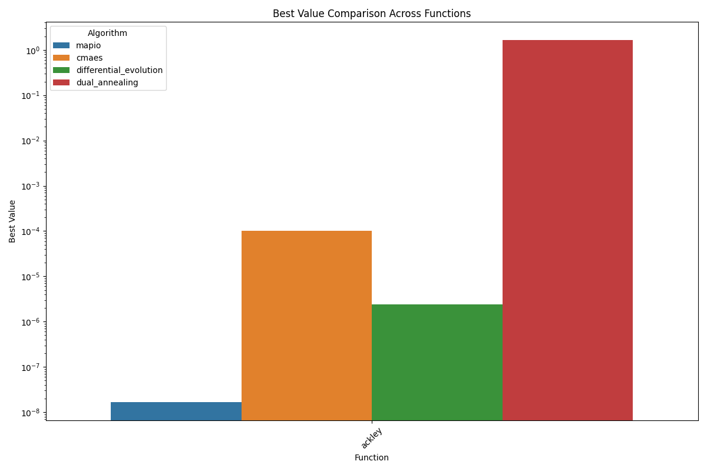
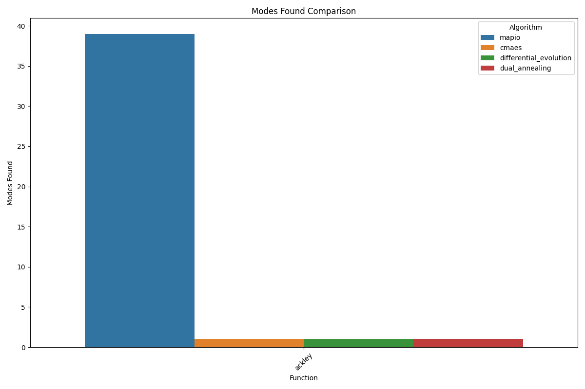
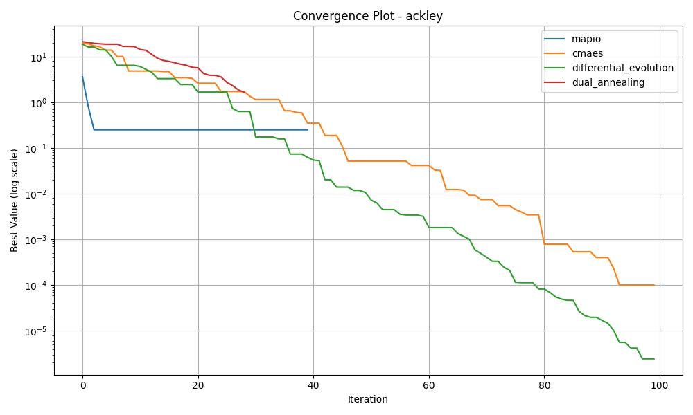
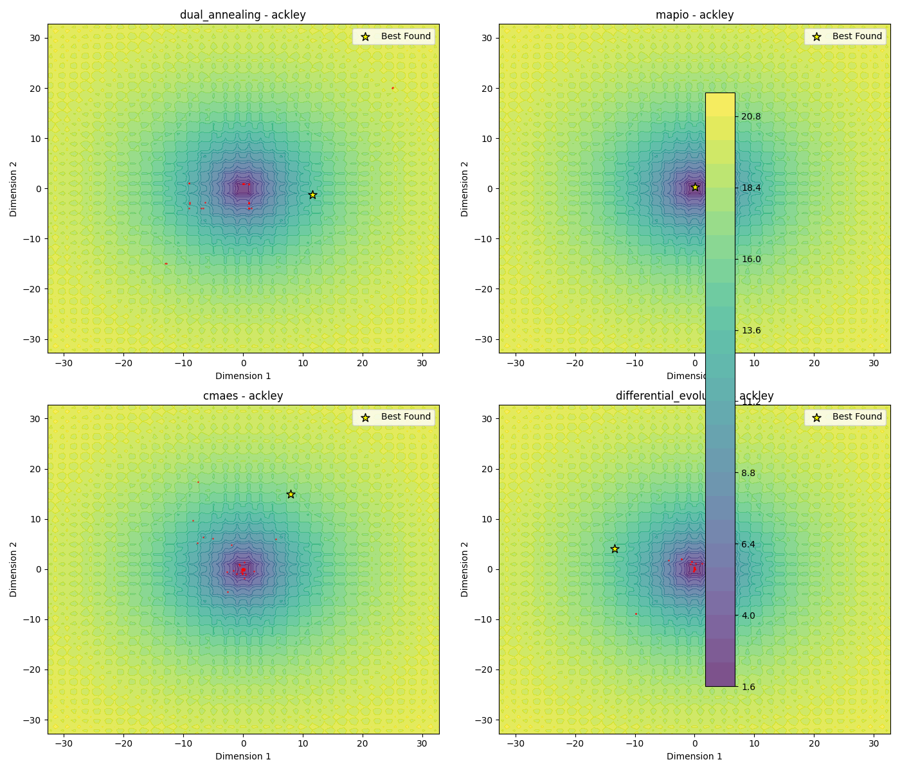
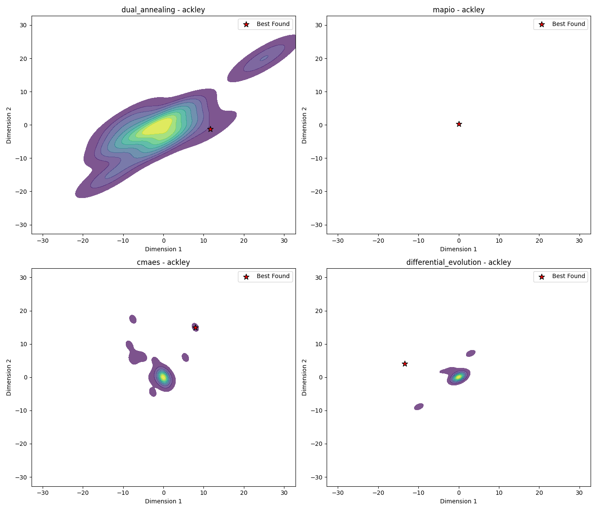
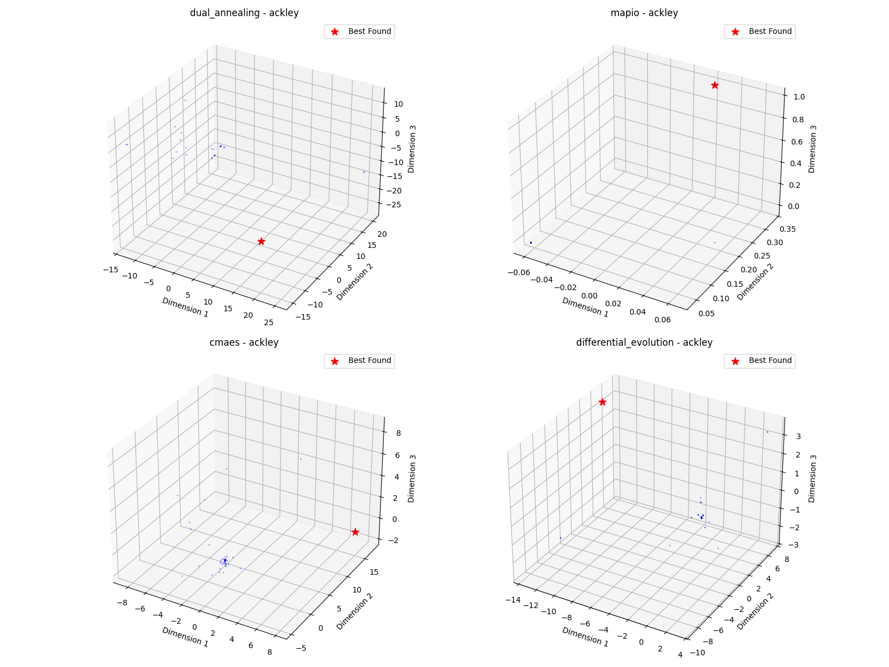

# Ackley-5d Optimization Algorithm Benchmark Report

*Generated on 2025-03-10 20:19:00*

## Benchmark Overview

**Test Functions:** ackley

**Algorithms:** cmaes, differential_evolution, dual_annealing, mapio

## Summary Results

| Function | Dimension | cmaes Best Value | differential_evolution Best Value | dual_annealing Best Value | mapio Best Value |
| --- | --- | --- | --- | --- | --- |
| ackley | 5 | 1.0087e-04 | 2.4341e-06 | 1.6462e+00 | 1.6586e-08 |

## Visualization Summary

## ackley Function

**Description:** Function with many local minima and a global minimum at the origin.

### Convergence Plot

### 2D Exploration

### Search Density

### 3D Exploration

### Algorithm Performance

| Algorithm | Best Value | Modes Found |
| --- | --- | --- |
| mapio | 1.658559e-08 | 39 |
| cmaes | 1.008705e-04 | 1 |
| differential_evolution | 2.434132e-06 | 1 |
| dual_annealing | 1.646224e+00 | 1 |

