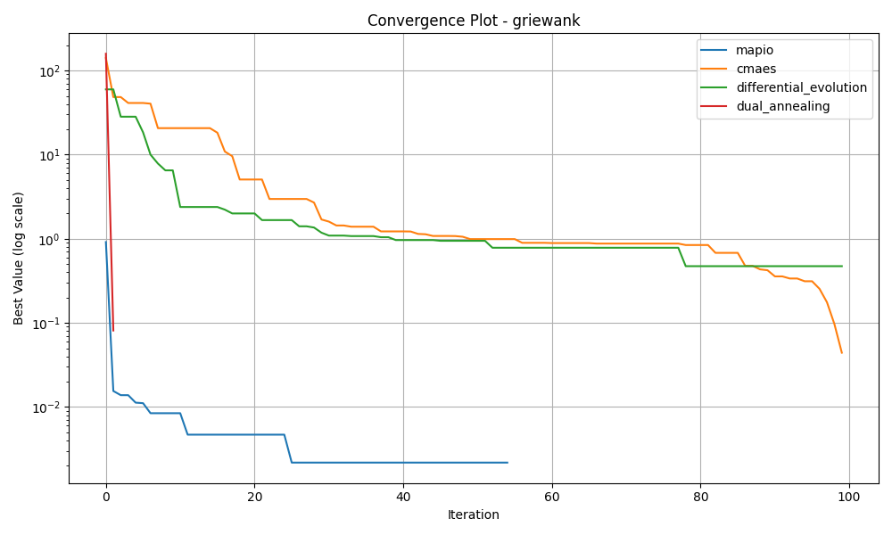

# Griewank-10d Optimization Algorithm Benchmark Report

*Generated on 2025-03-10 20:21:36*

## Benchmark Overview

**Test Functions:** griewank

**Algorithms:** cmaes, differential_evolution, dual_annealing, mapio

## Summary Results

| Function | Dimension | cmaes Best Value | differential_evolution Best Value | dual_annealing Best Value | mapio Best Value |
| --- | --- | --- | --- | --- | --- |
| griewank | 10 | 4.4261e-02 | 4.7267e-01 | 8.1261e-02 | 1.8065e-11 |

## Visualization Summary

## griewank Function

**Description:** Function with many widespread local minima.

### Convergence Plot

### 2D Exploration

### Search Density

### 3D Exploration

### Algorithm Performance

| Algorithm | Best Value | Modes Found |
| --- | --- | --- |
| mapio | 1.806466e-11 | 8 |
| cmaes | 4.426083e-02 | 1 |
| differential_evolution | 4.726729e-01 | 1 |
| dual_annealing | 8.126051e-02 | 1 |

