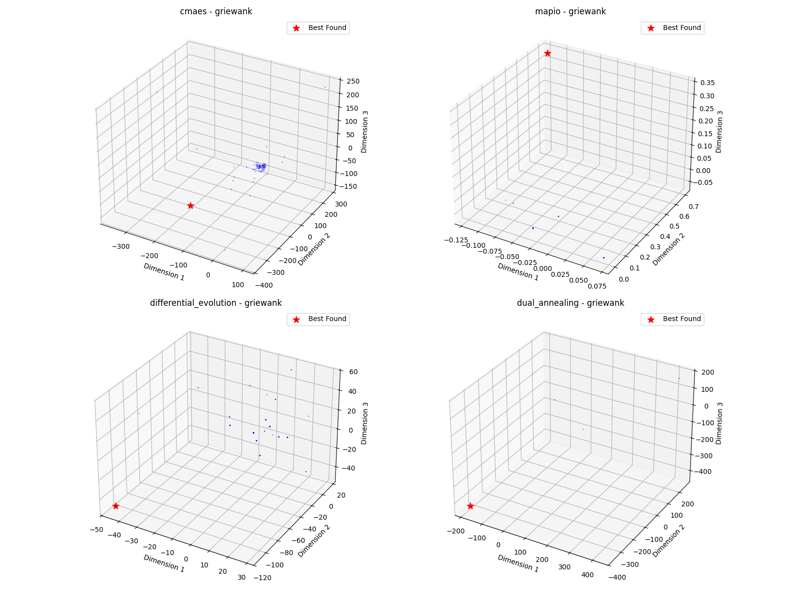

# Griewank-5d Optimization Algorithm Benchmark Report

*Generated on 2025-03-10 20:21:18*

## Benchmark Overview

**Test Functions:** griewank

**Algorithms:** cmaes, differential_evolution, dual_annealing, mapio

## Summary Results

| Function | Dimension | cmaes Best Value | differential_evolution Best Value | dual_annealing Best Value | mapio Best Value |
| --- | --- | --- | --- | --- | --- |
| griewank | 5 | 2.1657e-01 | 1.2849e-01 | 5.2503e-01 | 2.6289e-11 |

## Visualization Summary

## griewank Function

**Description:** Function with many widespread local minima.

### Convergence Plot

### 2D Exploration

### Search Density

### 3D Exploration

### Algorithm Performance

| Algorithm | Best Value | Modes Found |
| --- | --- | --- |
| mapio | 2.628864e-11 | 4 |
| cmaes | 2.165679e-01 | 1 |
| differential_evolution | 1.284916e-01 | 1 |
| dual_annealing | 5.250302e-01 | 1 |

