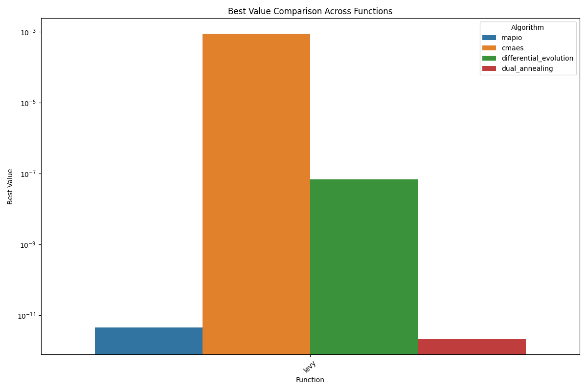
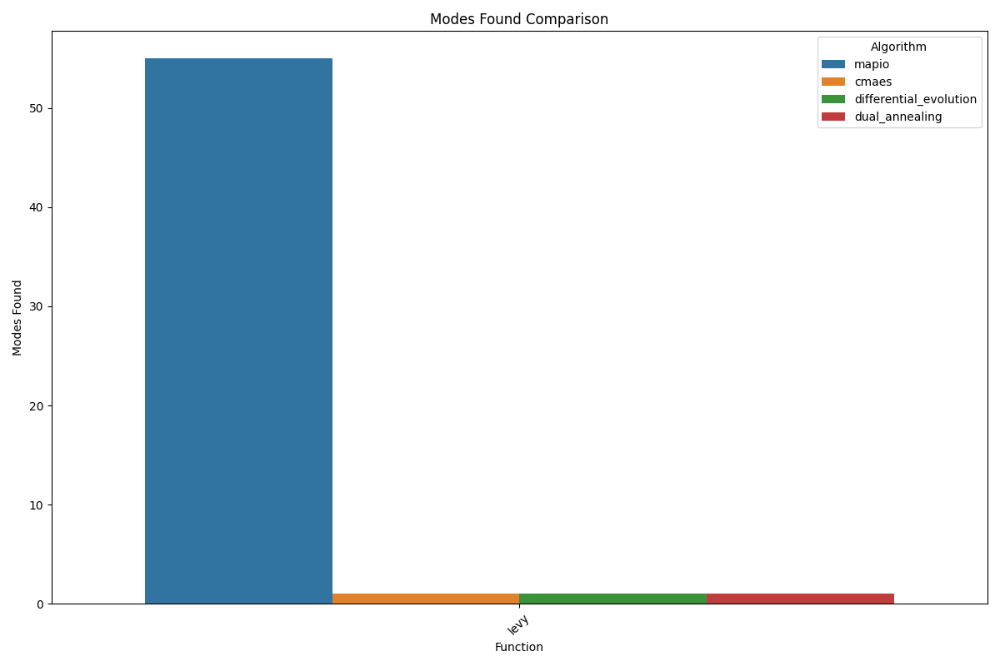
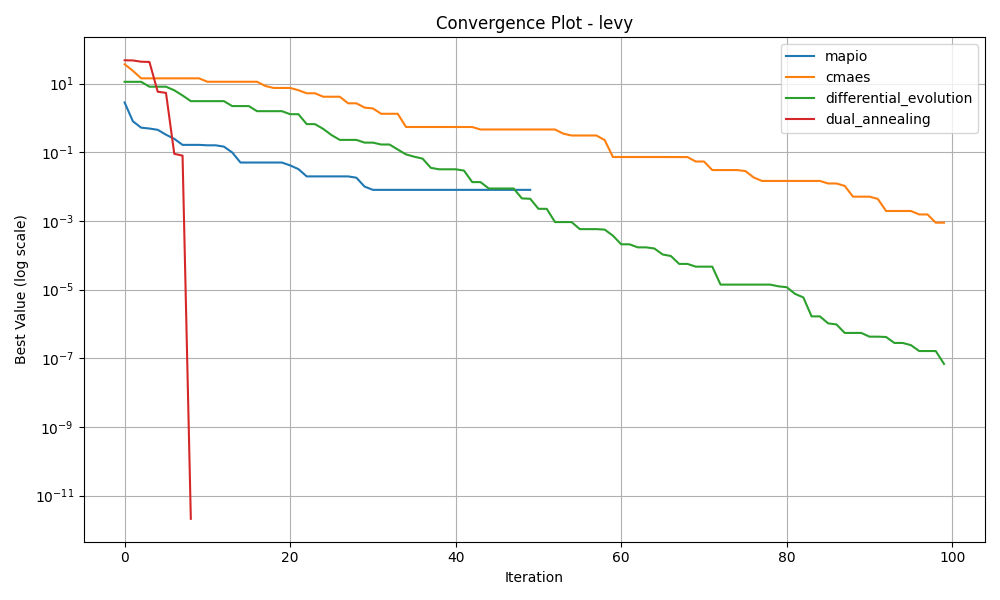
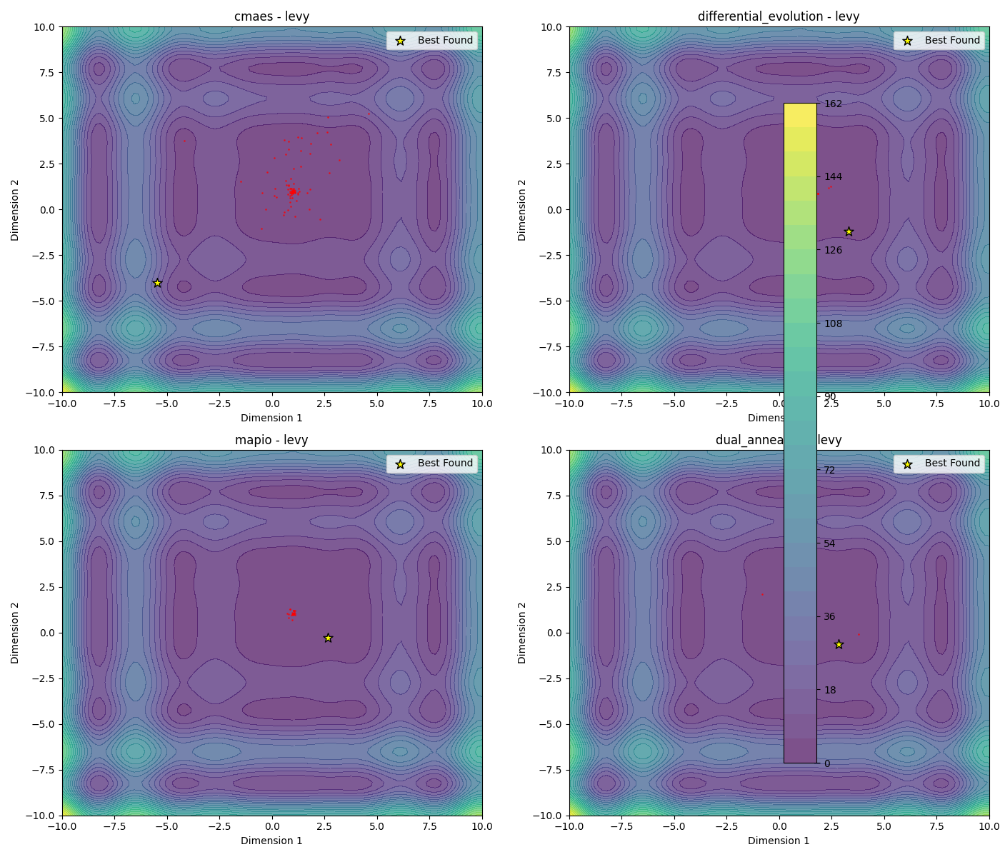
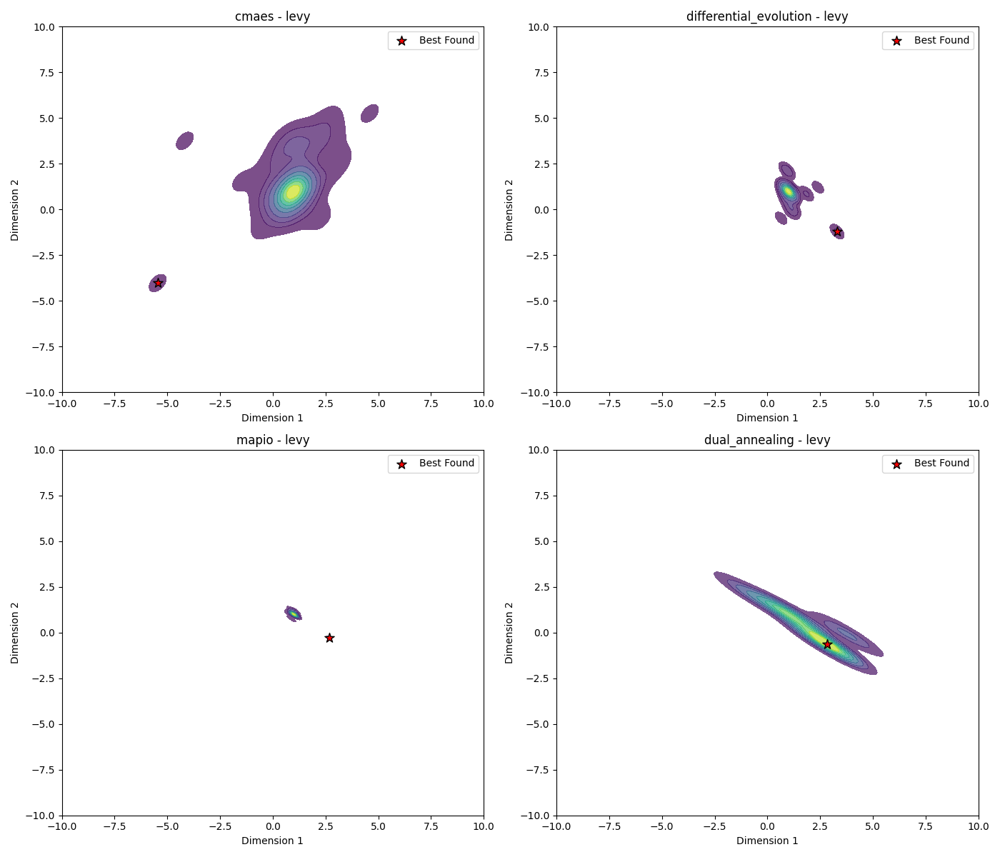
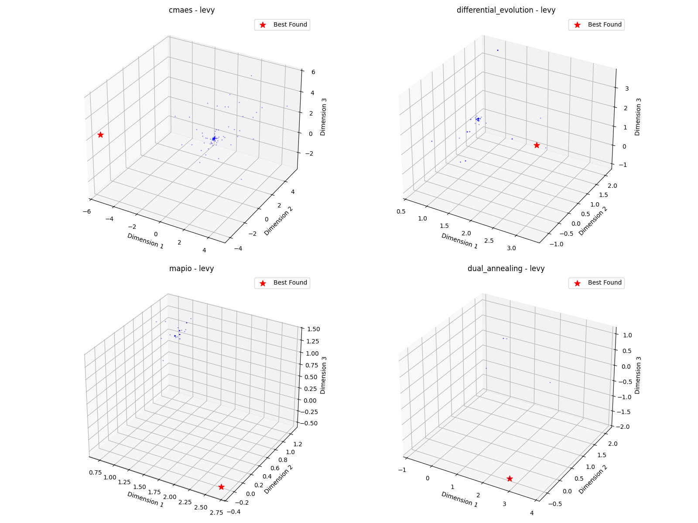

# Levy-10d Optimization Algorithm Benchmark Report

*Generated on 2025-03-10 20:19:49*

## Benchmark Overview

**Test Functions:** levy

**Algorithms:** cmaes, differential_evolution, dual_annealing, mapio

## Summary Results

| Function | Dimension | cmaes Best Value | differential_evolution Best Value | dual_annealing Best Value | mapio Best Value |
| --- | --- | --- | --- | --- | --- |
| levy | 10 | 8.8427e-04 | 6.7920e-08 | 2.0973e-12 | 4.4750e-12 |

## Visualization Summary

## levy Function

**Description:** Challenging multimodal function.

### Convergence Plot

### 2D Exploration

### Search Density

### 3D Exploration

### Algorithm Performance

| Algorithm | Best Value | Modes Found |
| --- | --- | --- |
| mapio | 4.474981e-12 | 55 |
| cmaes | 8.842650e-04 | 1 |
| differential_evolution | 6.792001e-08 | 1 |
| dual_annealing | 2.097329e-12 | 1 |

