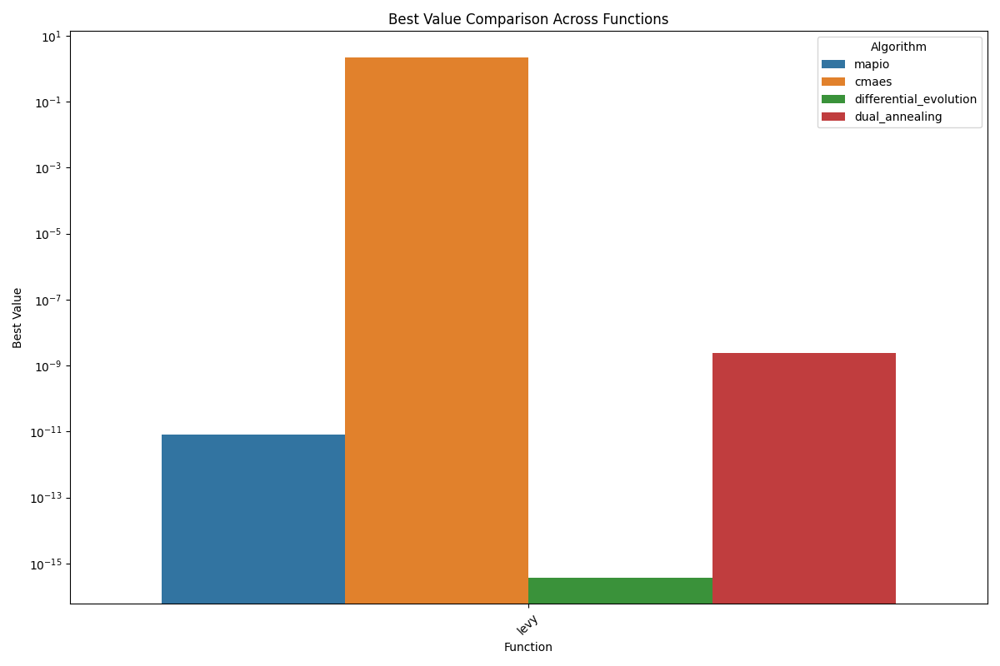
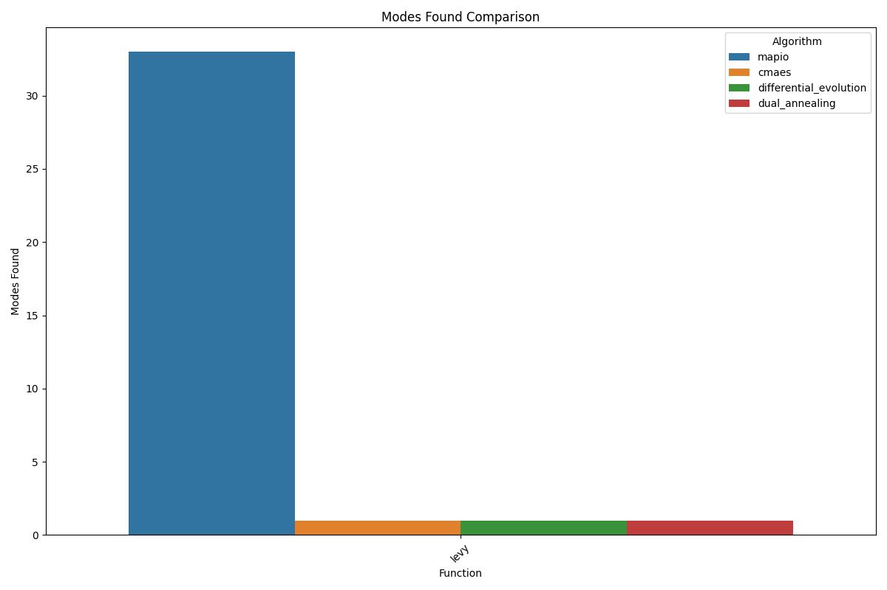
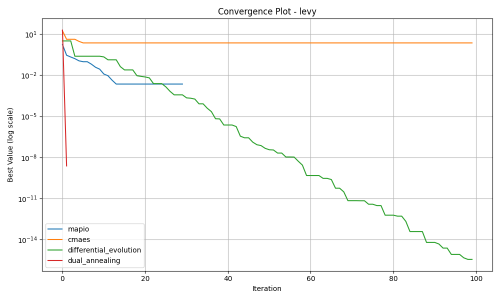
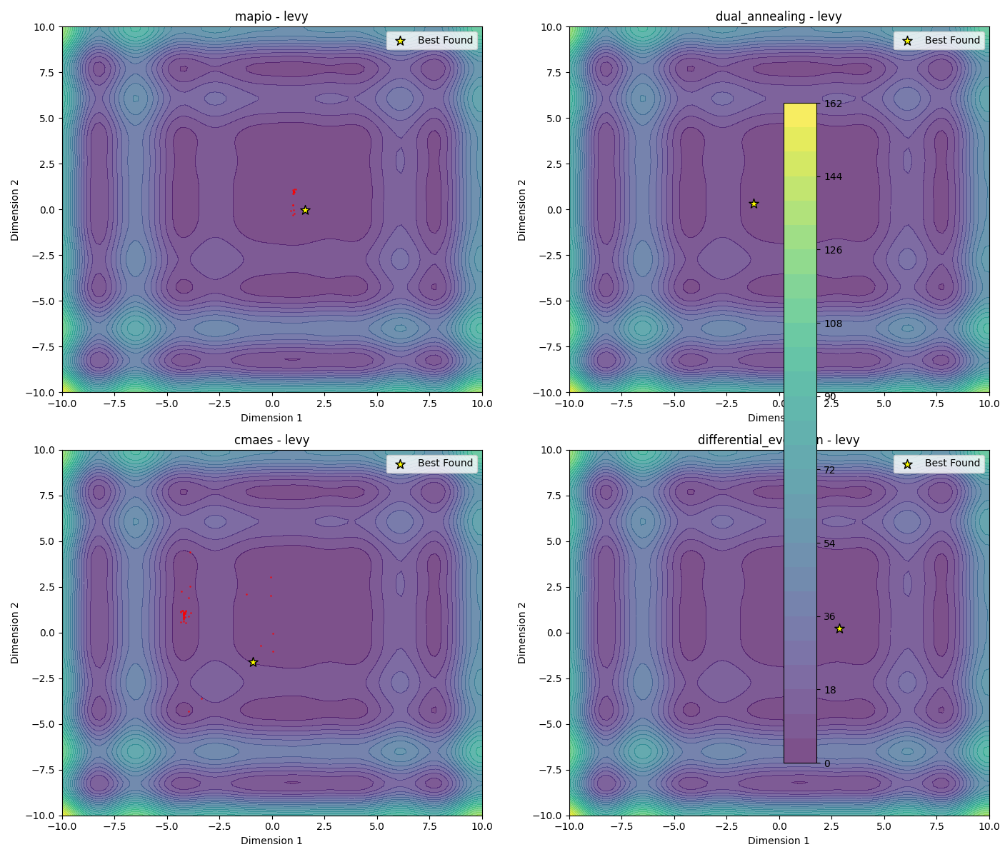
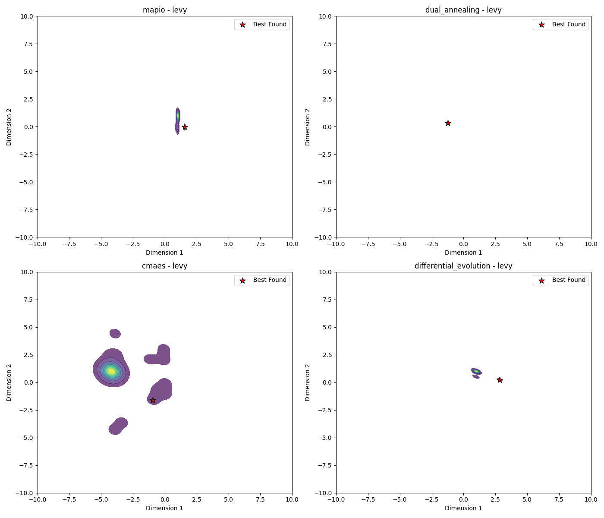
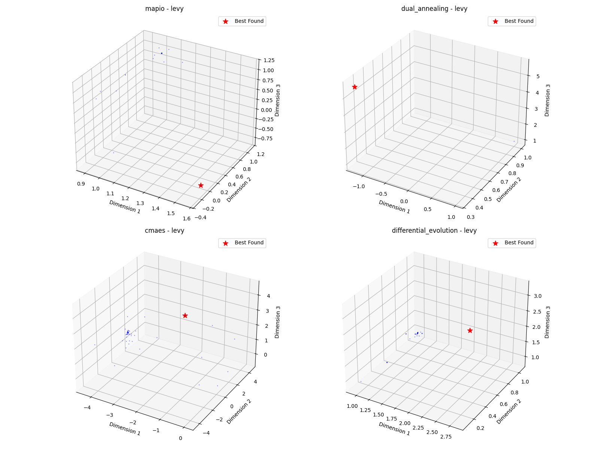

# Levy-5d Optimization Algorithm Benchmark Report

*Generated on 2025-03-10 20:19:20*

## Benchmark Overview

**Test Functions:** levy

**Algorithms:** cmaes, differential_evolution, dual_annealing, mapio

## Summary Results

| Function | Dimension | cmaes Best Value | differential_evolution Best Value | dual_annealing Best Value | mapio Best Value |
| --- | --- | --- | --- | --- | --- |
| levy | 5 | 2.2381e+00 | 3.6850e-16 | 2.4079e-09 | 8.1061e-12 |

## Visualization Summary

## levy Function

**Description:** Challenging multimodal function.

### Convergence Plot

### 2D Exploration

### Search Density

### 3D Exploration

### Algorithm Performance

| Algorithm | Best Value | Modes Found |
| --- | --- | --- |
| mapio | 8.106081e-12 | 33 |
| cmaes | 2.238124e+00 | 1 |
| differential_evolution | 3.685022e-16 | 1 |
| dual_annealing | 2.407871e-09 | 1 |

