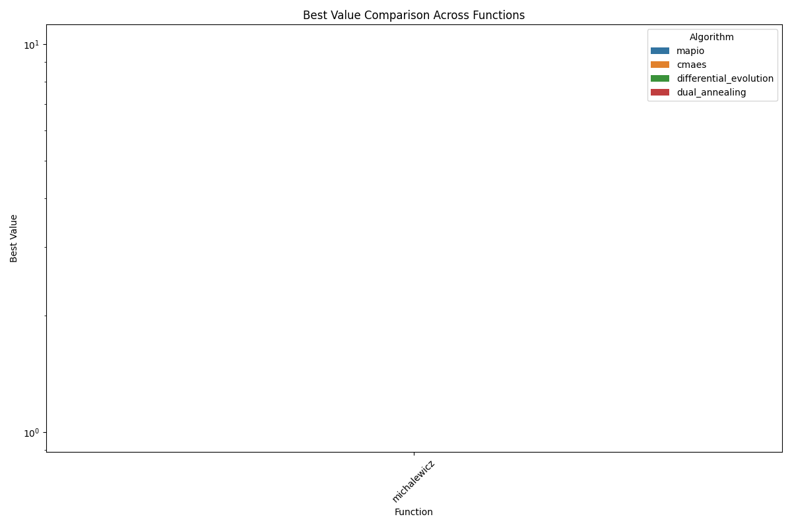
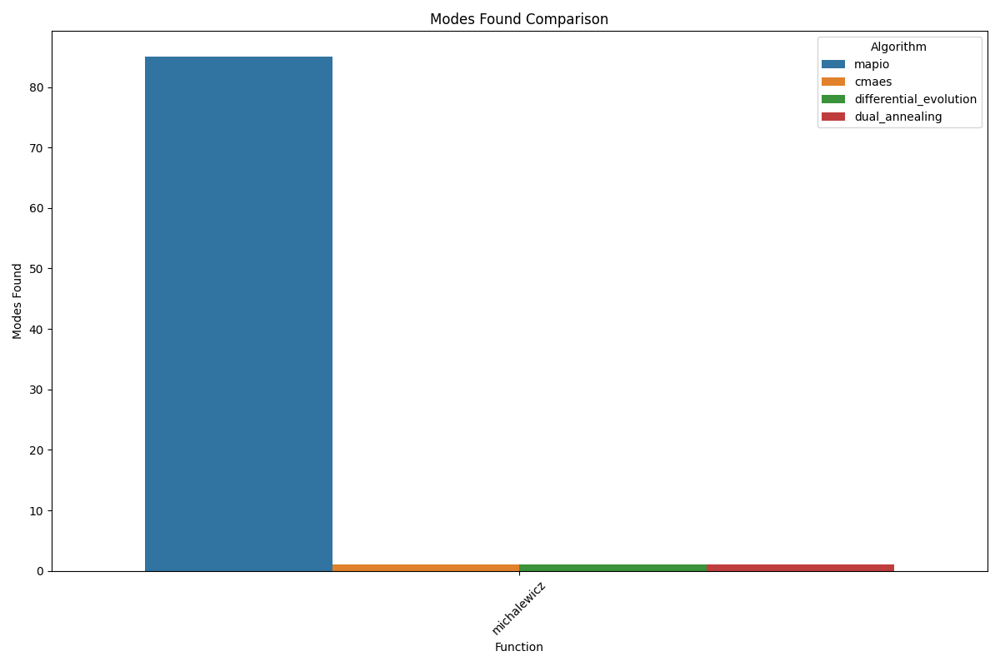
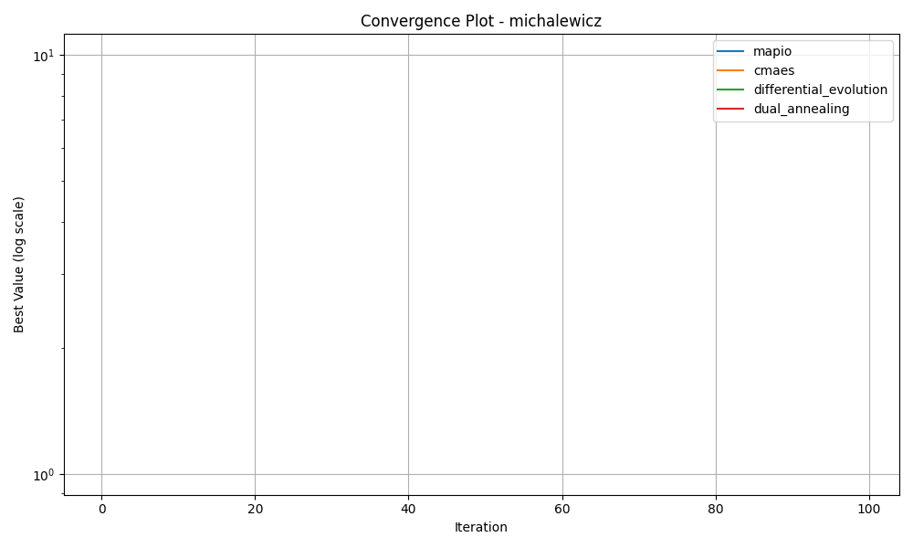
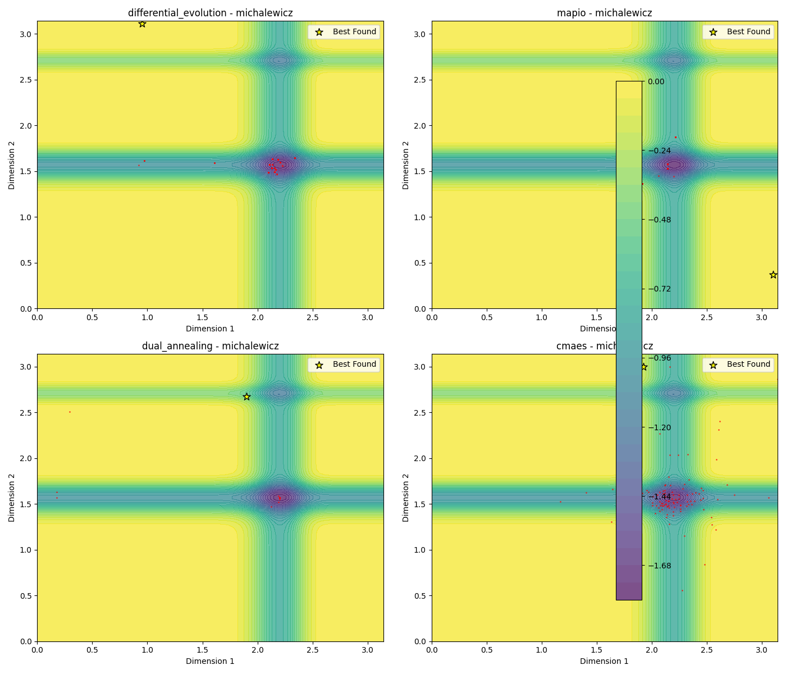
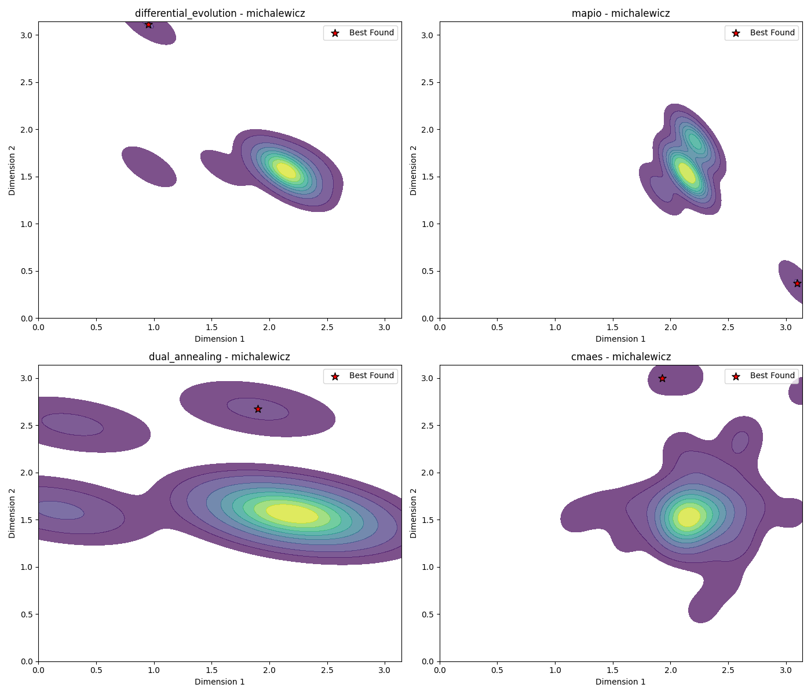
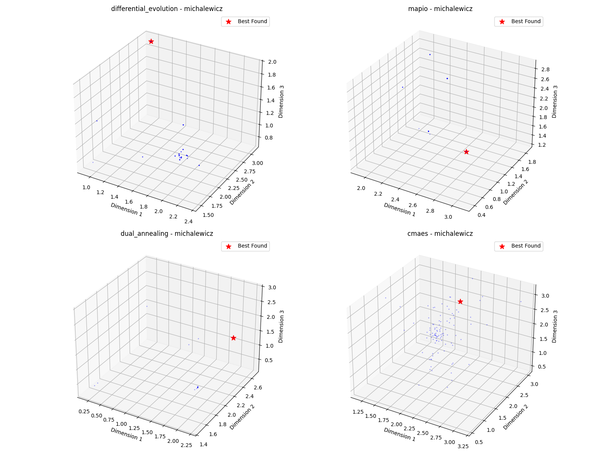

# Michalewicz-10d Optimization Algorithm Benchmark Report

*Generated on 2025-03-10 20:22:07*

## Benchmark Overview

**Test Functions:** michalewicz

**Algorithms:** cmaes, differential_evolution, dual_annealing, mapio

## Summary Results

| Function | Dimension | cmaes Best Value | differential_evolution Best Value | dual_annealing Best Value | mapio Best Value |
| --- | --- | --- | --- | --- | --- |
| michalewicz | 10 | -5.9175e+00 | -9.0562e+00 | -9.6184e+00 | -8.0871e+00 |

## Visualization Summary

## michalewicz Function

**Description:** Function with steep ridges and valleys.

### Convergence Plot

### 2D Exploration

### Search Density

### 3D Exploration

### Algorithm Performance

| Algorithm | Best Value | Modes Found |
| --- | --- | --- |
| mapio | -8.087140e+00 | 85 |
| cmaes | -5.917477e+00 | 1 |
| differential_evolution | -9.056215e+00 | 1 |
| dual_annealing | -9.618389e+00 | 1 |

