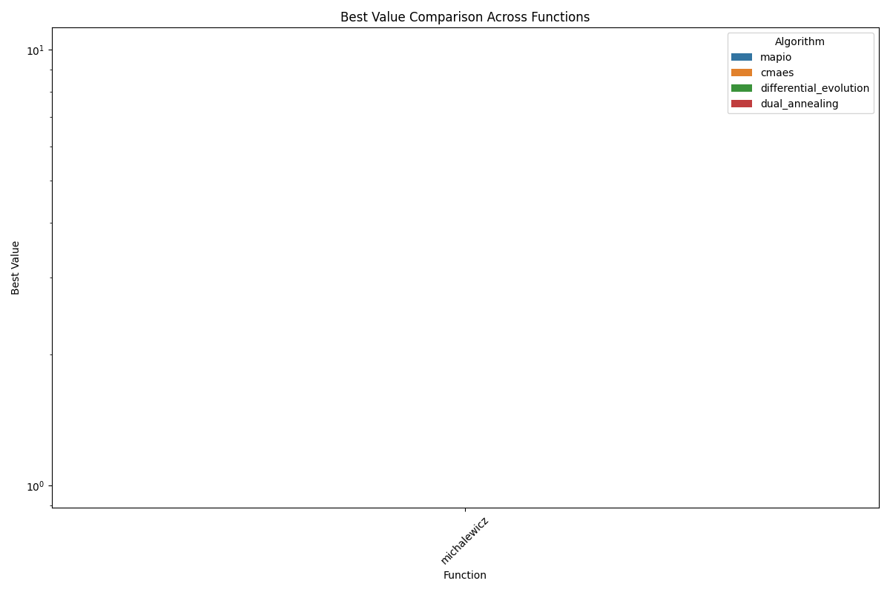
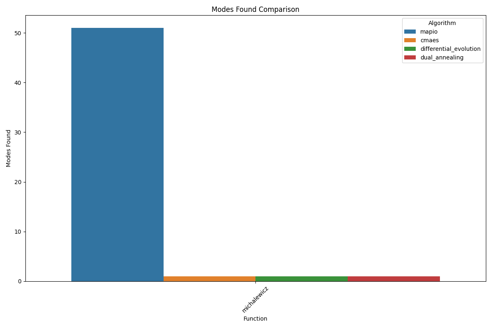
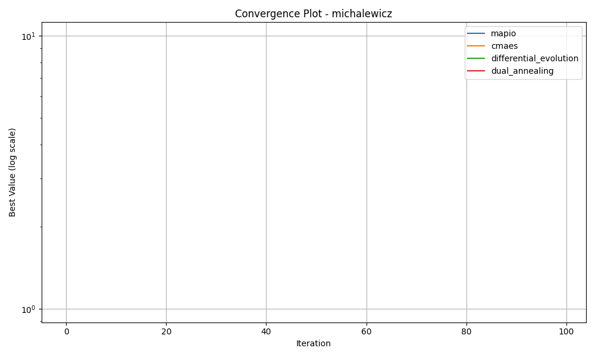
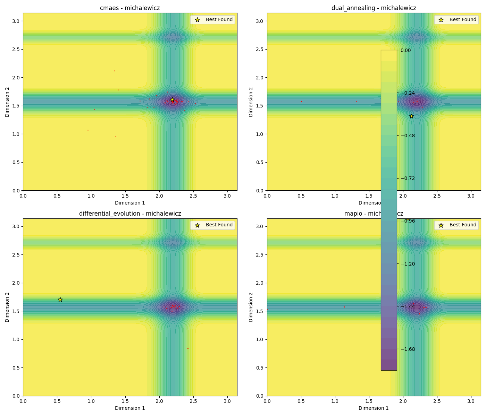
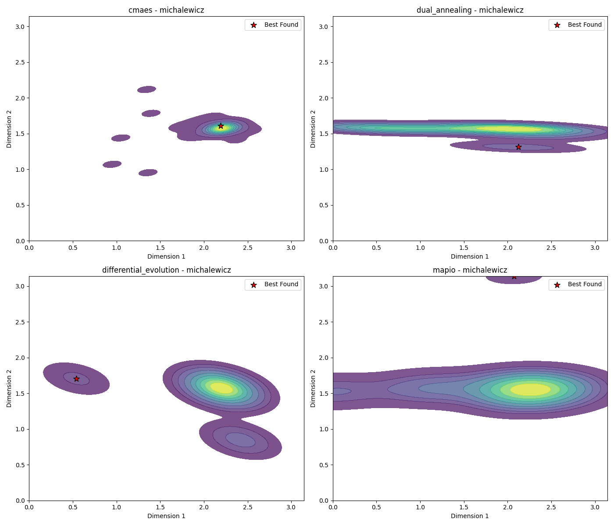
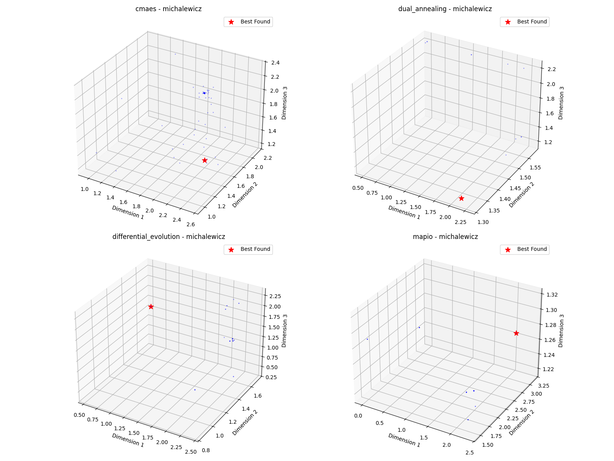

# Michalewicz-5d Optimization Algorithm Benchmark Report

*Generated on 2025-03-10 20:22:44*

## Benchmark Overview

**Test Functions:** michalewicz

**Algorithms:** cmaes, differential_evolution, dual_annealing, mapio

## Summary Results

| Function | Dimension | cmaes Best Value | differential_evolution Best Value | dual_annealing Best Value | mapio Best Value |
| --- | --- | --- | --- | --- | --- |
| michalewicz | 5 | -4.0486e+00 | -4.6338e+00 | -4.6459e+00 | -4.5377e+00 |

## Visualization Summary

## michalewicz Function

**Description:** Function with steep ridges and valleys.

### Convergence Plot

### 2D Exploration

### Search Density

### 3D Exploration

### Algorithm Performance

| Algorithm | Best Value | Modes Found |
| --- | --- | --- |
| mapio | -4.537656e+00 | 51 |
| cmaes | -4.048565e+00 | 1 |
| differential_evolution | -4.633781e+00 | 1 |
| dual_annealing | -4.645895e+00 | 1 |

