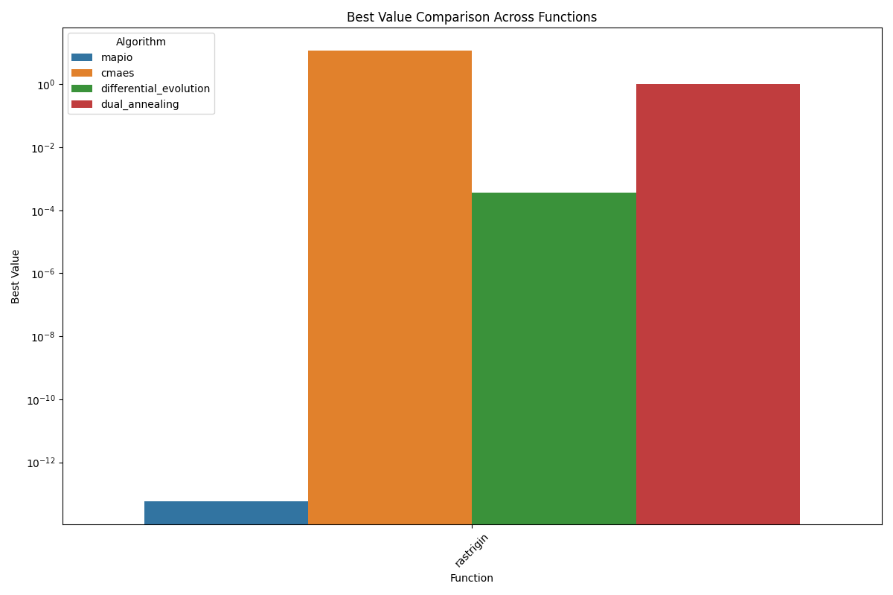
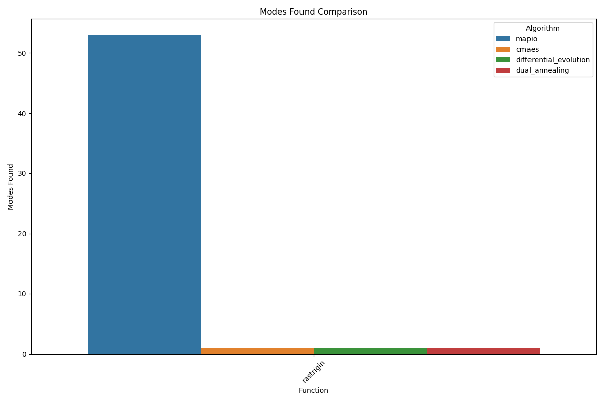
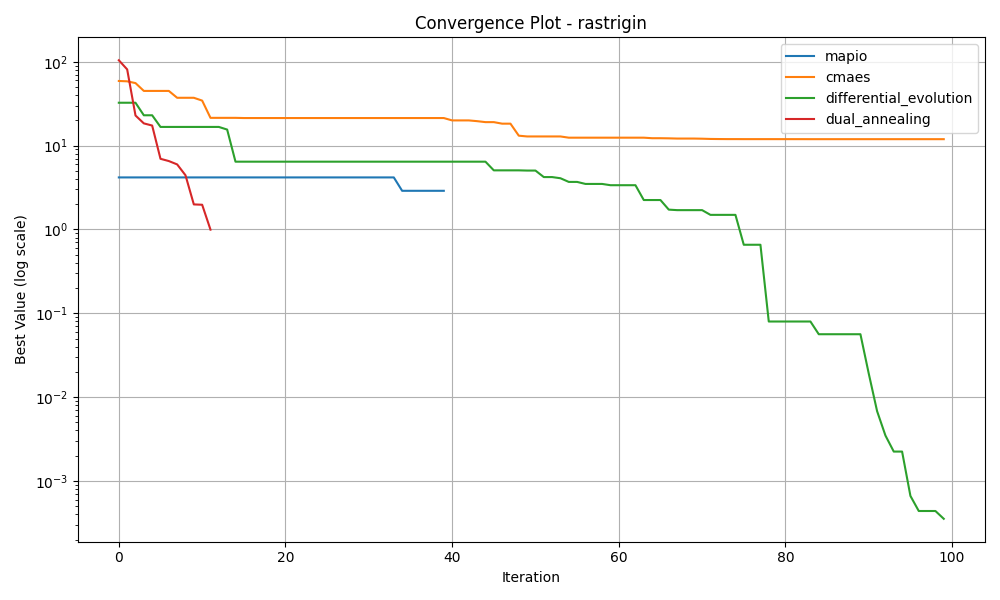
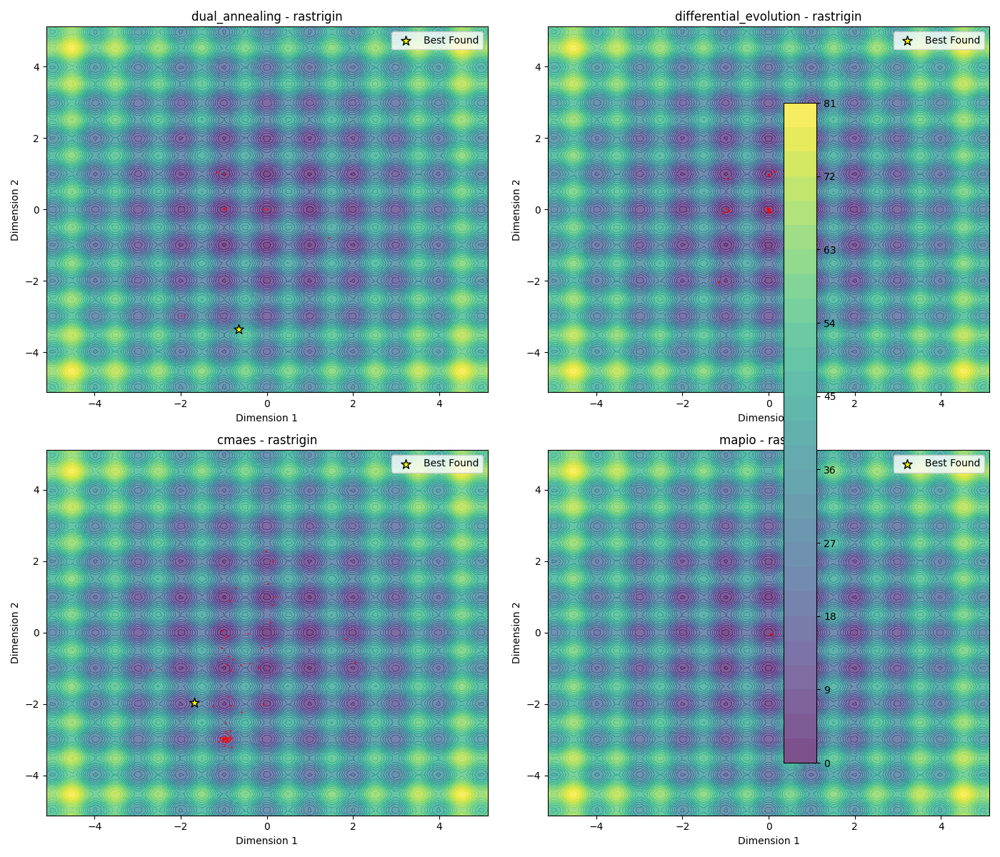
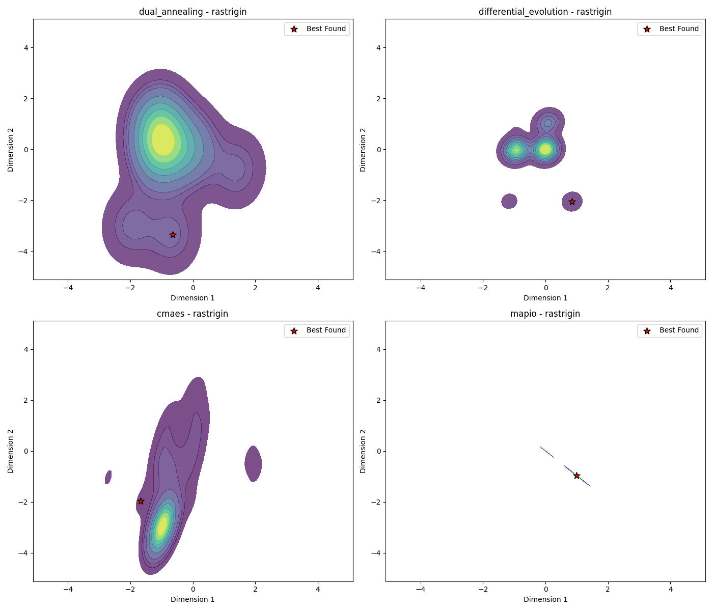
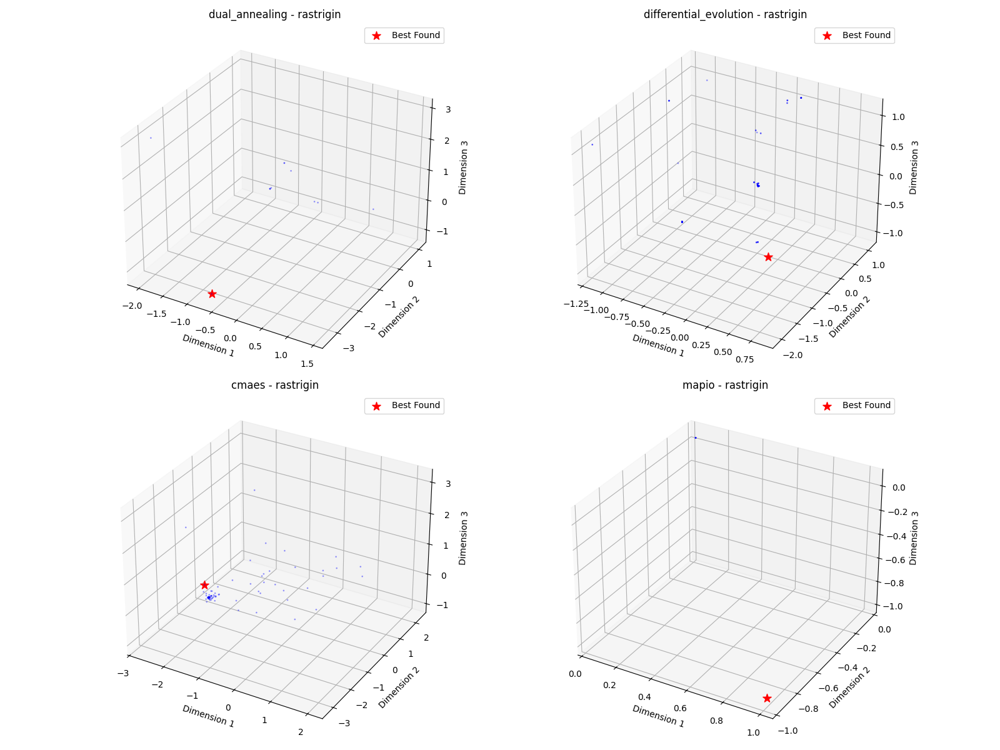

# Rastrigin-5d Optimization Algorithm Benchmark Report

*Generated on 2025-03-10 19:57:46*

## Benchmark Overview

**Test Functions:** rastrigin

**Algorithms:** cmaes, differential_evolution, dual_annealing, mapio

## Summary Results

| Function | Dimension | cmaes Best Value | differential_evolution Best Value | dual_annealing Best Value | mapio Best Value |
| --- | --- | --- | --- | --- | --- |
| rastrigin | 5 | 1.1940e+01 | 3.5383e-04 | 9.9496e-01 | 5.6843e-14 |

## Visualization Summary

## rastrigin Function

**Description:** Highly multimodal function with many regularly distributed local minima.

### Convergence Plot

### 2D Exploration

### Search Density

### 3D Exploration

### Algorithm Performance

| Algorithm | Best Value | Modes Found |
| --- | --- | --- |
| mapio | 5.684342e-14 | 53 |
| cmaes | 1.194026e+01 | 1 |
| differential_evolution | 3.538258e-04 | 1 |
| dual_annealing | 9.949591e-01 | 1 |

