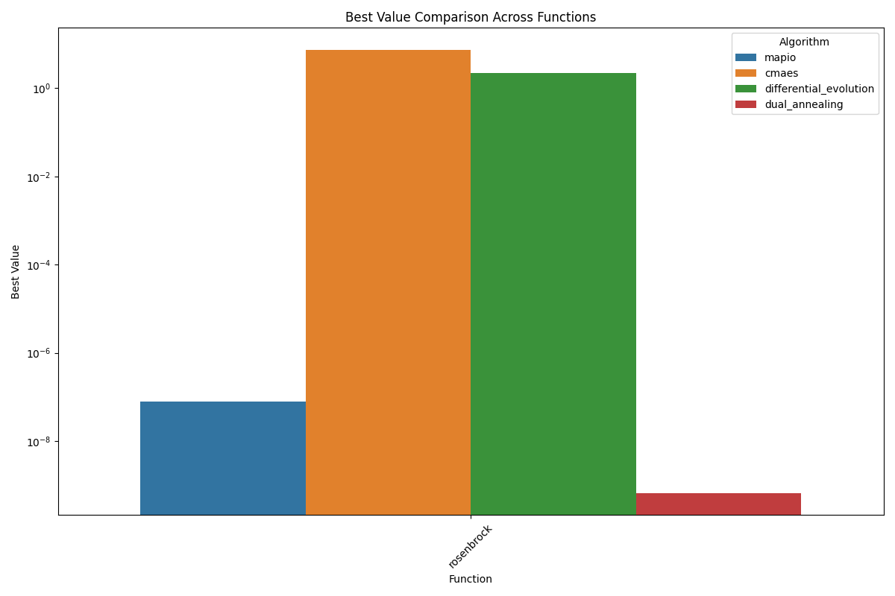
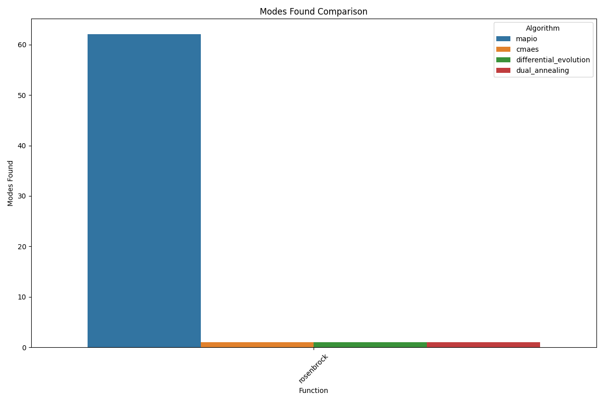
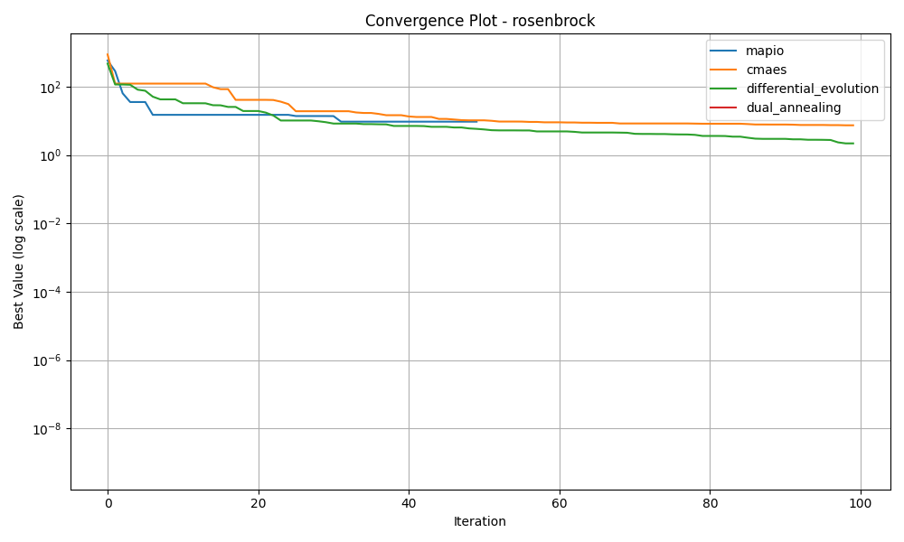
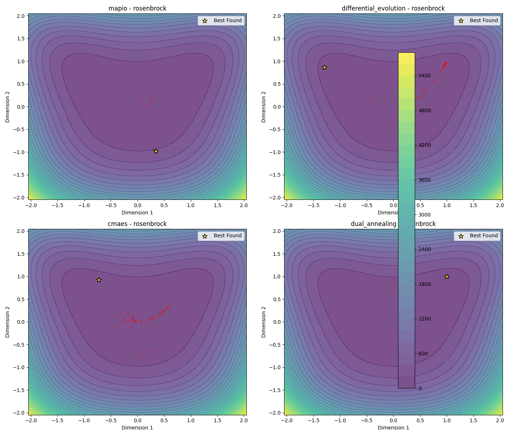
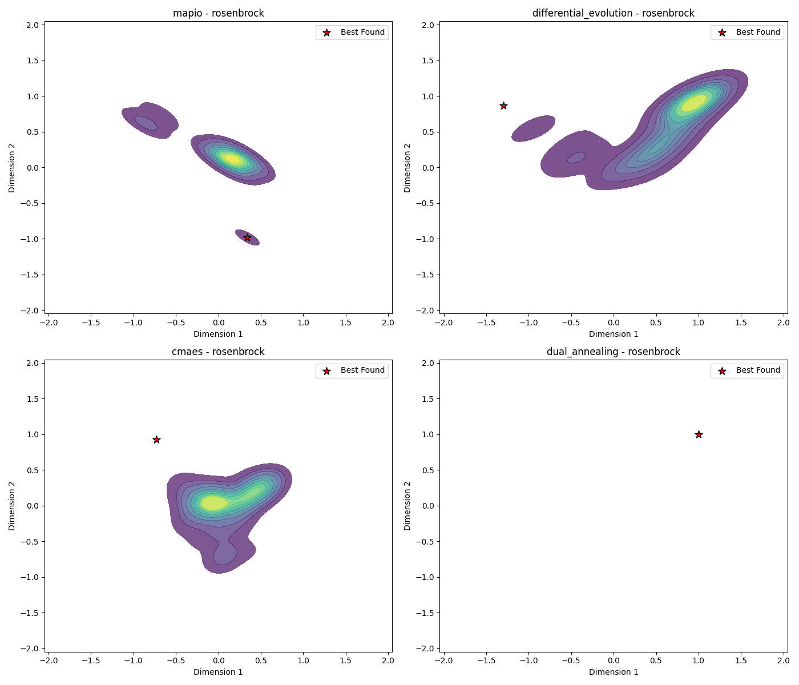
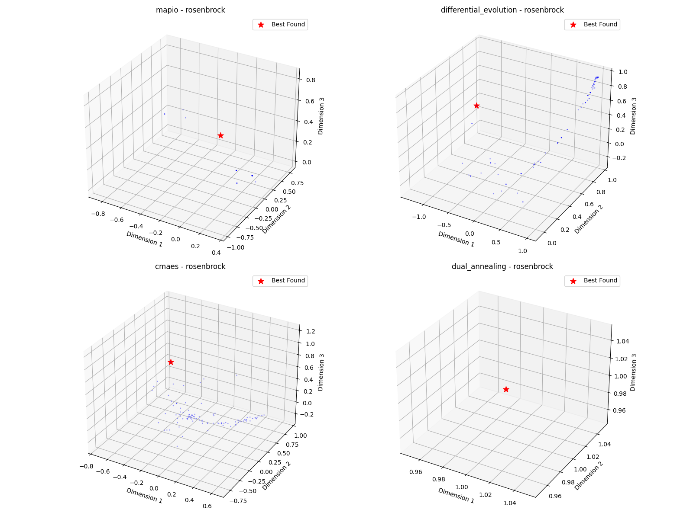

# Rosenbrock-10d Optimization Algorithm Benchmark Report

*Generated on 2025-03-10 20:18:15*

## Benchmark Overview

**Test Functions:** rosenbrock

**Algorithms:** cmaes, differential_evolution, dual_annealing, mapio

## Summary Results

| Function | Dimension | cmaes Best Value | differential_evolution Best Value | dual_annealing Best Value | mapio Best Value |
| --- | --- | --- | --- | --- | --- |
| rosenbrock | 10 | 7.3871e+00 | 2.1845e+00 | 6.6571e-10 | 7.8881e-08 |

## Visualization Summary

## rosenbrock Function

**Description:** Function with a narrow valley leading to the global minimum.

### Convergence Plot

### 2D Exploration

### Search Density

### 3D Exploration

### Algorithm Performance

| Algorithm | Best Value | Modes Found |
| --- | --- | --- |
| mapio | 7.888114e-08 | 62 |
| cmaes | 7.387064e+00 | 1 |
| differential_evolution | 2.184456e+00 | 1 |
| dual_annealing | 6.657051e-10 | 1 |

