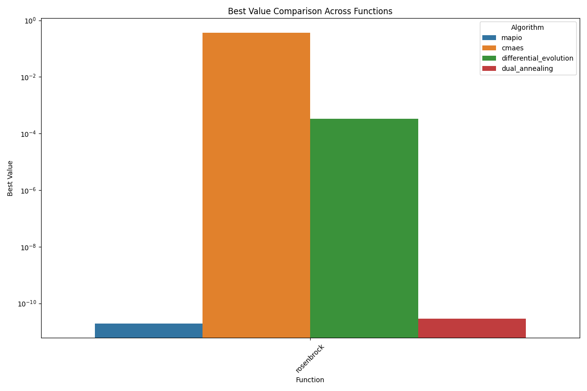
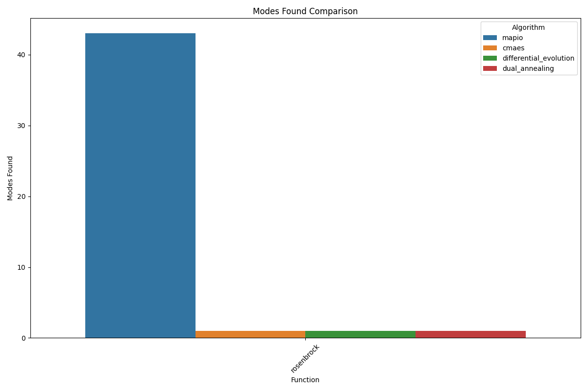
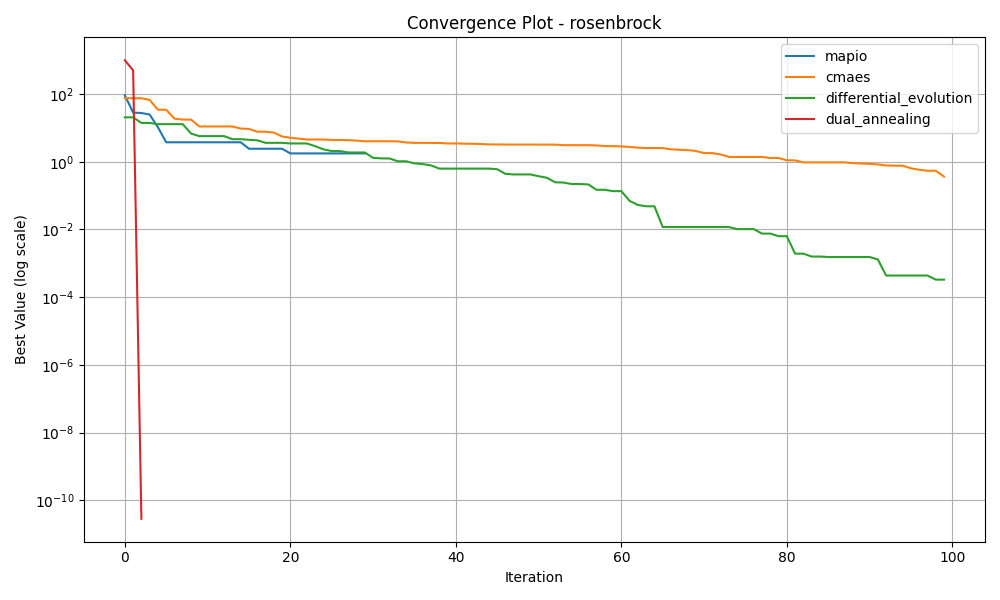
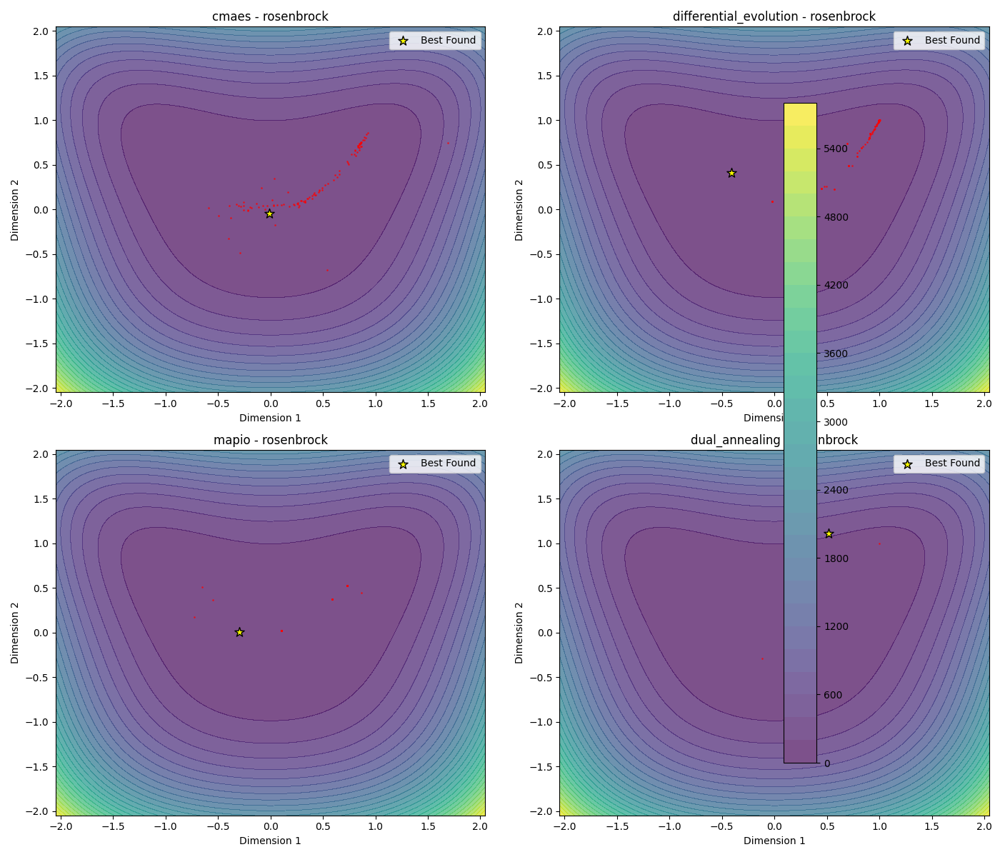
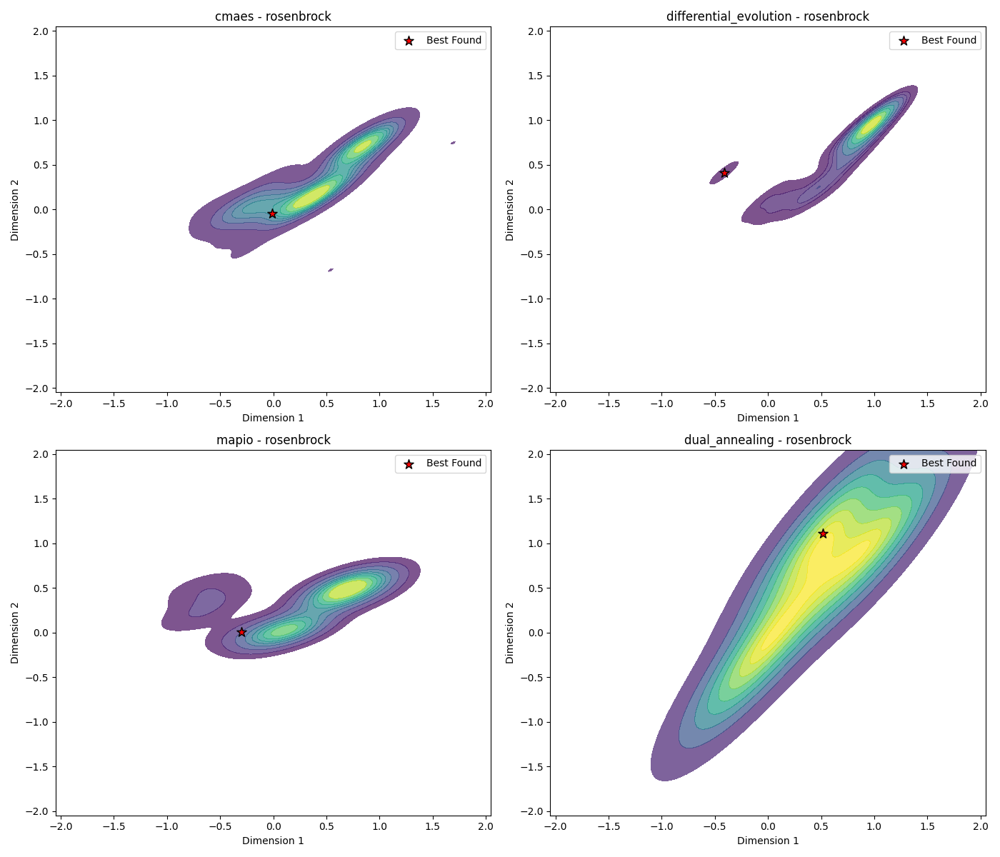
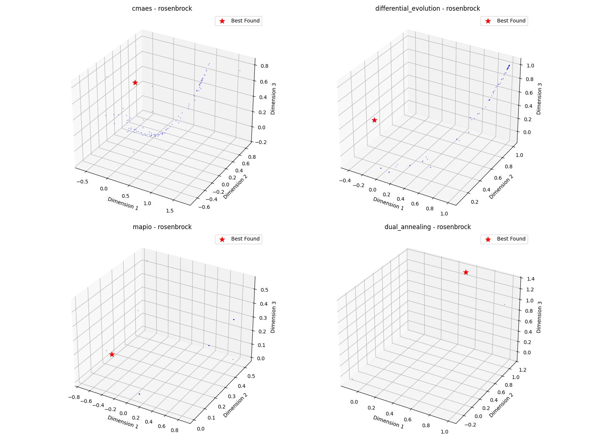

# Rosenbrock-5d Optimization Algorithm Benchmark Report

*Generated on 2025-03-10 20:15:11*

## Benchmark Overview

**Test Functions:** rosenbrock

**Algorithms:** cmaes, differential_evolution, dual_annealing, mapio

## Summary Results

| Function | Dimension | cmaes Best Value | differential_evolution Best Value | dual_annealing Best Value | mapio Best Value |
| --- | --- | --- | --- | --- | --- |
| rosenbrock | 5 | 3.6284e-01 | 3.2895e-04 | 2.8420e-11 | 1.9531e-11 |

## Visualization Summary

## rosenbrock Function

**Description:** Function with a narrow valley leading to the global minimum.

### Convergence Plot

### 2D Exploration

### Search Density

### 3D Exploration

### Algorithm Performance

| Algorithm | Best Value | Modes Found |
| --- | --- | --- |
| mapio | 1.953087e-11 | 43 |
| cmaes | 3.628416e-01 | 1 |
| differential_evolution | 3.289514e-04 | 1 |
| dual_annealing | 2.841964e-11 | 1 |

