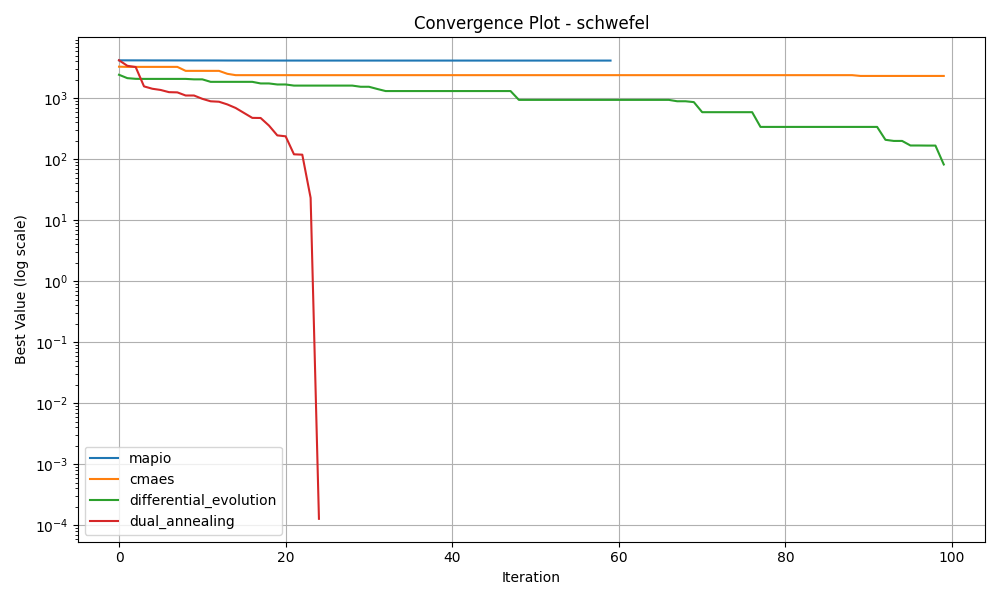

# Schwefel-10d Optimization Algorithm Benchmark Report

*Generated on 2025-03-10 20:20:29*

## Benchmark Overview

**Test Functions:** schwefel

**Algorithms:** cmaes, differential_evolution, dual_annealing, mapio

## Summary Results

| Function | Dimension | cmaes Best Value | differential_evolution Best Value | dual_annealing Best Value | mapio Best Value |
| --- | --- | --- | --- | --- | --- |
| schwefel | 10 | 2.3134e+03 | 8.1815e+01 | 1.2728e-04 | 4.1302e+03 |

## Visualization Summary

## schwefel Function

**Description:** Deceptive function where the global minimum is far from the next best local minima.

### Convergence Plot

### 2D Exploration

### Search Density

### 3D Exploration

### Algorithm Performance

| Algorithm | Best Value | Modes Found |
| --- | --- | --- |
| mapio | 4.130238e+03 | 23 |
| cmaes | 2.313403e+03 | 1 |
| differential_evolution | 8.181524e+01 | 1 |
| dual_annealing | 1.272800e-04 | 1 |

