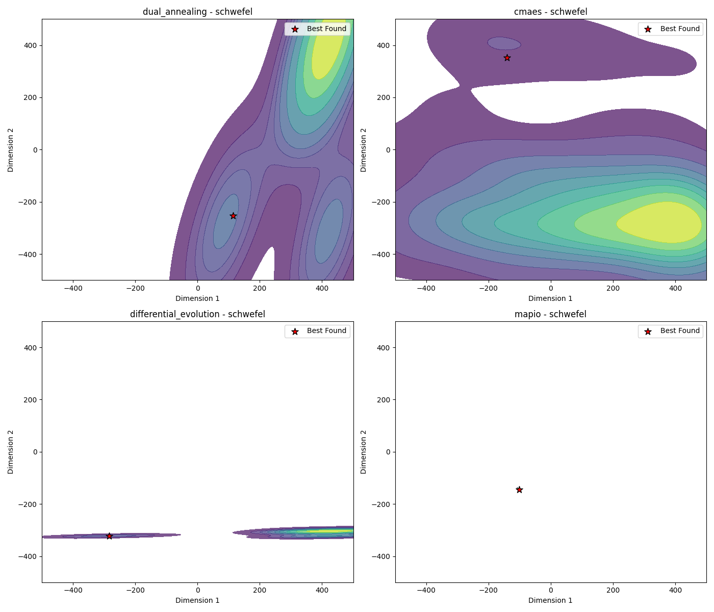

# Schwefel-5d Optimization Algorithm Benchmark Report

*Generated on 2025-03-10 20:20:42*

## Benchmark Overview

**Test Functions:** schwefel

**Algorithms:** cmaes, differential_evolution, dual_annealing, mapio

## Summary Results

| Function | Dimension | cmaes Best Value | differential_evolution Best Value | dual_annealing Best Value | mapio Best Value |
| --- | --- | --- | --- | --- | --- |
| schwefel | 5 | 7.5164e+02 | 2.3765e+02 | 6.3639e-05 | 1.6010e+03 |

## Visualization Summary

## schwefel Function

**Description:** Deceptive function where the global minimum is far from the next best local minima.

### Convergence Plot

### 2D Exploration

### Search Density

### 3D Exploration

### Algorithm Performance

| Algorithm | Best Value | Modes Found |
| --- | --- | --- |
| mapio | 1.600993e+03 | 16 |
| cmaes | 7.516381e+02 | 1 |
| differential_evolution | 2.376478e+02 | 1 |
| dual_annealing | 6.363934e-05 | 1 |

