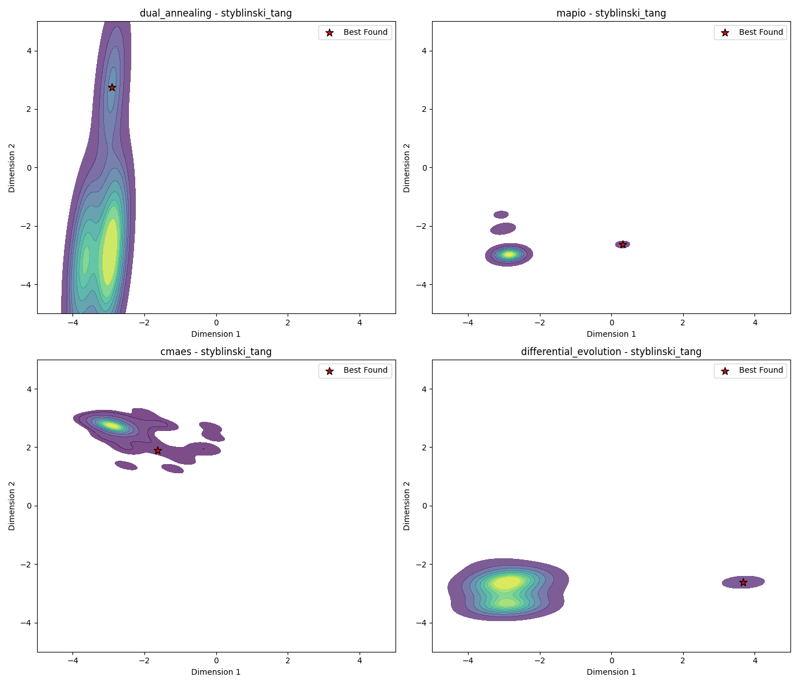

# Styblinski_tang-10d Optimization Algorithm Benchmark Report

*Generated on 2025-03-10 20:24:07*

## Benchmark Overview

**Test Functions:** styblinski_tang

**Algorithms:** cmaes, differential_evolution, dual_annealing, mapio

## Summary Results

| Function | Dimension | cmaes Best Value | differential_evolution Best Value | dual_annealing Best Value | mapio Best Value |
| --- | --- | --- | --- | --- | --- |
| styblinski_tang | 10 | -2.6443e+02 | -3.9042e+02 | -3.9166e+02 | -3.4925e+02 |

## Visualization Summary

## styblinski_tang Function

**Description:** Function with multiple local minima.

### Convergence Plot

### 2D Exploration

### Search Density

### 3D Exploration

### Algorithm Performance

| Algorithm | Best Value | Modes Found |
| --- | --- | --- |
| mapio | -3.492515e+02 | 13 |
| cmaes | -2.644308e+02 | 1 |
| differential_evolution | -3.904209e+02 | 1 |
| dual_annealing | -3.916617e+02 | 1 |

