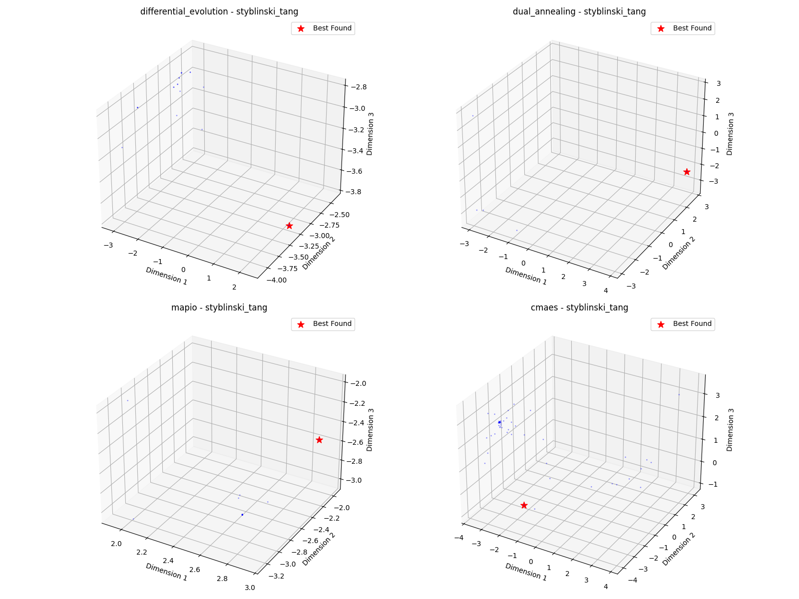

# Styblinski_tang-5d Optimization Algorithm Benchmark Report

*Generated on 2025-03-10 20:23:27*

## Benchmark Overview

**Test Functions:** styblinski_tang

**Algorithms:** cmaes, differential_evolution, dual_annealing, mapio

## Summary Results

| Function | Dimension | cmaes Best Value | differential_evolution Best Value | dual_annealing Best Value | mapio Best Value |
| --- | --- | --- | --- | --- | --- |
| styblinski_tang | 5 | -1.8169e+02 | -1.9537e+02 | -1.9583e+02 | -1.6756e+02 |

## Visualization Summary

## styblinski_tang Function

**Description:** Function with multiple local minima.

### Convergence Plot

### 2D Exploration

### Search Density

### 3D Exploration

### Algorithm Performance

| Algorithm | Best Value | Modes Found |
| --- | --- | --- |
| mapio | -1.675574e+02 | 39 |
| cmaes | -1.816941e+02 | 1 |
| differential_evolution | -1.953704e+02 | 1 |
| dual_annealing | -1.958308e+02 | 1 |

